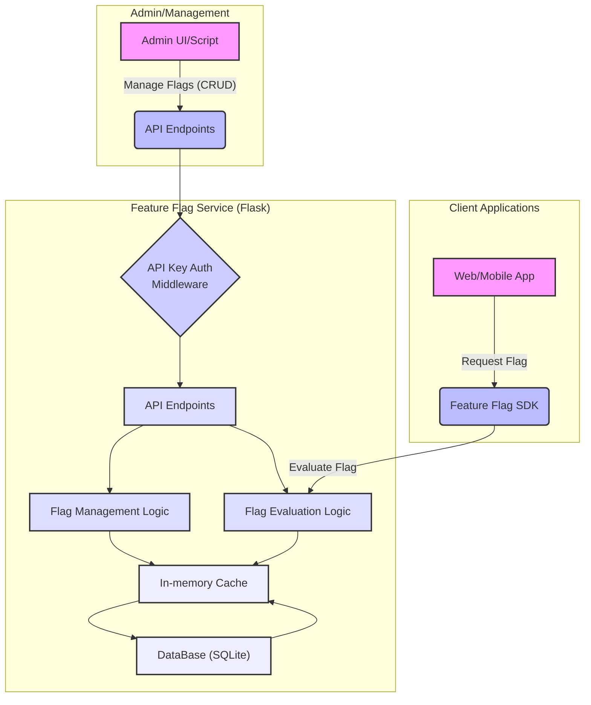
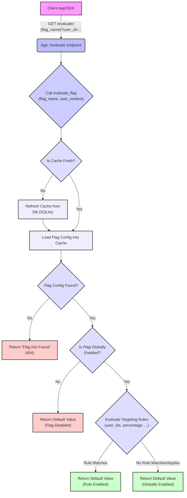

# Micro Feature Flag App

## Micro Feature Flag Service Architecture

This diagram illustrates the main components of the Flask application and how they interact with each other and external entities.

### Explanation

* **Client Applications**: Your actual web or mobile applications that consume feature flags. They conceptually use an "SDK" (represented by B) to interact with your service.
* **Admin/Management**: This represents any tool (a simple script or a future web UI) that an administrator or product manager would use to create, update, or delete feature flags.
  * **Micro Feature Flag Service (Flask App)**: This is the core of your Python application.
  * **API Key Auth Middleware**: Intercepts requests for write operations (POST, PUT, DELETE) to ensure they carry a valid API key for basic security.
  * **API Endpoints**: The various ``/flags`` and ``/evaluate`` routes that handle incoming HTTP requests.
  * **Flag Management Logic**: Handles the creation, retrieval, updating, and deletion of flag configurations, primarily interacting with the database.
  * **Flag Evaluation Logic**: Determines the state of a flag for a given user context, using the cached configurations.
  * **In-memory Cache**: Stores frequently accessed flag configurations to reduce database load and improve response times. It periodically refreshes from the database.
  * **SQLite Database**: The persistent storage for all feature flag definitions and their associated rules.

## Feature Flag Evaluation Flow

This diagram details the steps involved when a client application requests to evaluate a feature flag.

### Explanation

* **Client Request**: A client application (or its SDK) makes an HTTP GET request to the ``/evaluate/{flag_name}`` endpoint, optionally including user context as query parameters.
* **Endpoint Call**: The Flask app receives the request at the ``/evaluate`` endpoint.
* ``evaluate_flag`` **Call**: The endpoint calls the ``evaluate_flag`` function, passing the flag name and user context.
* **Cache Check**: The ``evaluate_flag`` function first checks if the in-memory cache is fresh.
  * If **not fresh**, it triggers a refresh from the SQLite database.
  * If **fresh**, it proceeds directly to load the flag configuration.
* **Load Config**: The flag configuration is loaded from the cache.
* **Flag Found Check**: It verifies if the requested flag exists. If not, an error is returned.
* **Global Enablement Check**: It checks if the flag is globally enabled. If disabled, the ``default_value`` is returned.
* **Targeting Rules Evaluation**: If globally enabled, the service then evaluates any defined targeting rules (e.g., ``user_ids``, ``percentage``) against the provided ``user_context``.
* **Return Value**:
  * If a targeting rule matches and enables the flag, the ``default_value`` (or a specific value defined by the rule, though this micro-service only returns ``default_value`` if enabled) is returned.
  * If no specific rules match or apply (and the flag is globally enabled), the ``default_value`` is returned.
